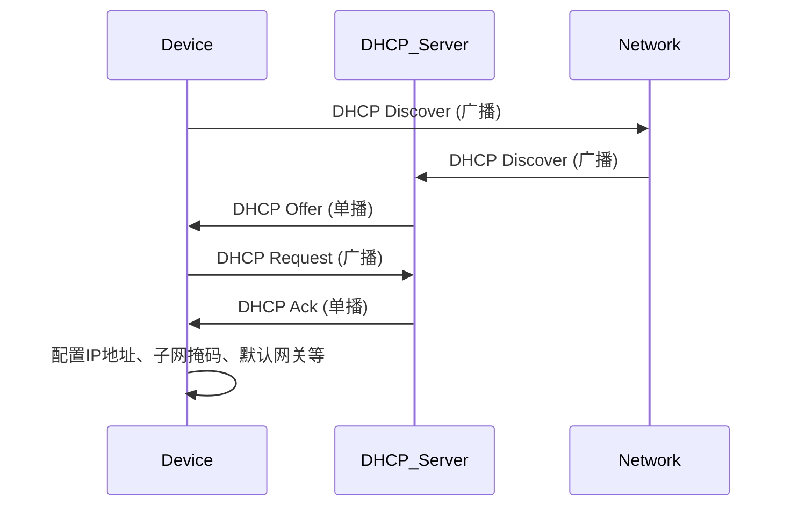
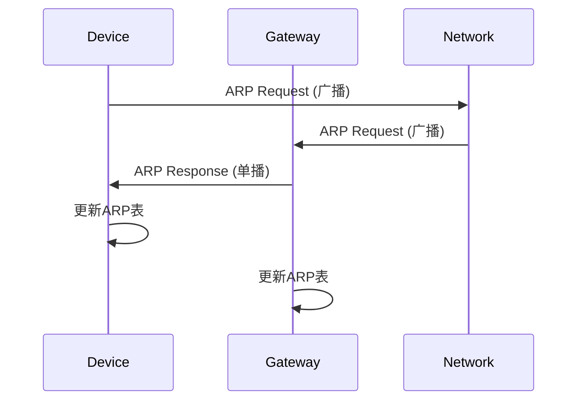

# TCP/IP协议
TCP/IP是分别工作于传输层与网络层的两个协议，这两个协议构成了互联网信息传输的基石
# 路由与交换机
`路由` :时工作在三层的一种设备，主要处理的是关于网络层的IP协议的包，
`交换机`:是一种工作在二层的设备，交换机同时也有三层交换机，也就是同时具有交换和路由功能的交换机.交换机的trunk与access模式，主要就是这个端口能不能传输多个vlan信息。传统情况下，access负责与设备终端相连的模式，trunk则是交换机之间的模式。当出现两台交换机分别有着多个相同的vlan区域时，trunk就可以传输多个vlan帧。如SWA与SWB，SWA有vlan10，vlan20，vlan30。SWB也有vlan10，vlan20，vlan30。则这两台交换机之间的相同vlan通过trunk通信

# VBRAS
一种虚拟远程拨号服务器，主要基于虚拟化还有一些用户态高性能网络处理包开发的一种软件式远程宽带接入服务软件。他的主要目的就是将传统的BRAS设备的转发平面与控制平面解耦合，由交换机或路由器这种专门的网络处理设备进行radius报文的转发，报文转发给VBRAS后再进行处理，VBRAS通过与其他服务的协同调用，如网端融合管理平台，radius服务器，3a认证平台联合联合调用，决定是否放行或认证该设备进行网络访问。
# Radius协议

# 防代理
防代理主要目的是为了在一些进行流量管理的单位，如校园网，防止通过类似于DNS 53端口，采用类似VPN工具进行发送混淆后的UDP包，实现绕过认证直连互联网。


DHCP流程

ARP流程




```mermaid
graph TD A[task.go] --> B(TaskDialup) A --> C(TaskDialupTest) A --> D(TaskListenStop) A --> E(TaskListenStart) B --> F(HandleDialup) C --> G(HandleDialupTest) D --> H(HandleStop) E --> I(HandleStart) F --> J(CheckUserSource) F --> K(HandleDialupStart) F --> L(HandleDialupStop) K --> M(CheckAllowDial) K --> N(GetUserInfo) K --> O(GetIspByAccount) K --> P(GetNasInfo) K --> Q(CheckFocusIpv4) K --> R(BrasCoa) K --> S(DialUpStartCoa) L --> T(GetIspOnlineBySessionId) L --> U(GetNasInfo) L --> V(GetIspByAccount) L --> W(DialUpDM) G --> X(GetUserInfo) G --> Y(GetIspByCode) G --> Z(DialupCoaTest) H --> AA(UnmarshalMessage) H --> AB(CheckIpAddresses) H --> AC(PublishDialup) I --> AD(UnmarshalMessage) I --> AE(CheckIpAddresses) I --> AF(PublishDialup)
```